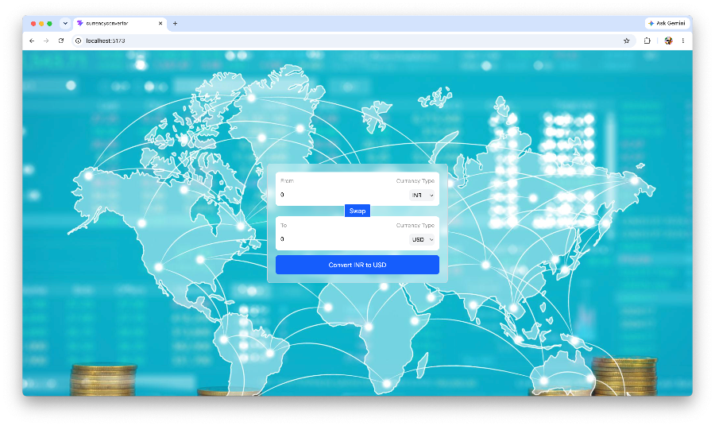

# 🚀 Currency Converter App

A modern and responsive **Currency Converter Web App** built using **React.js**.  
It allows users to convert currencies in real-time with a clean and user-friendly interface.

---

## 🌐 Live Demo

👉 https://your-app.vercel.app  
<!-- Deploy hone ke baad yaha apna Vercel link paste kar dena -->

---

## 📸 Screenshots

### 🏠 Home UI

### 💱 Currency Conversion

### 🔁 Swap Feature

---

## ✨ Features

- 🔄 Real-time currency conversion  
- 💱 Multiple currency support (INR, USD, etc.)  
- 🔁 Swap currencies functionality  
- ⚡ Fast and responsive UI  
- 🎨 Clean and modern design  

---

## 🛠️ Tech Stack

- ⚛️ React.js  
- 🎨 Tailwind CSS  
- 🌐 Currency API  

---

## ⚙️ Installation & Setup

Follow these steps to run the project locally:

**Clone the repository**

git clone https://github.com/yamini-rani17/currencyConvertor.git

**Navigate to project folder**

cd currencyConvertor

**Install dependencies**

npm install

**Start the development server**

npm run dev

---

## 🚀 Deployment

This project can be deployed using:

- ▲ Vercel  
- 🌐 Netlify  

---

## 📌 Future Improvements

- 🌍 Add more currencies  
- 📊 Show historical data  
- 📱 Improve mobile responsiveness  

---

## 🙋‍♀️ Author

**Yamini Rani**  
- GitHub: https://github.com/yamini-rani17  

---

## ⭐ Show your support

If you like this project, please ⭐ the repository!

